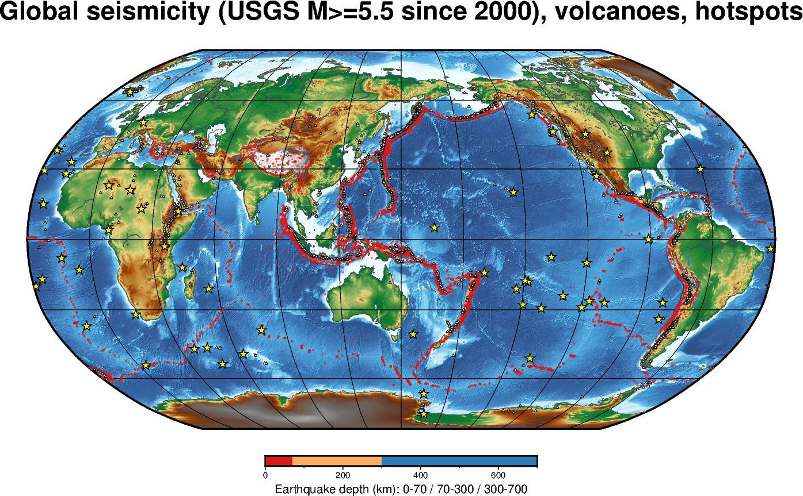
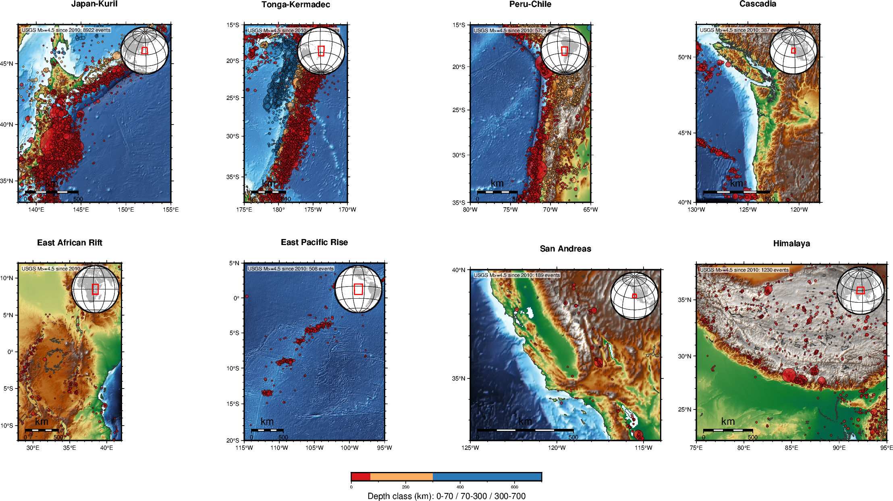
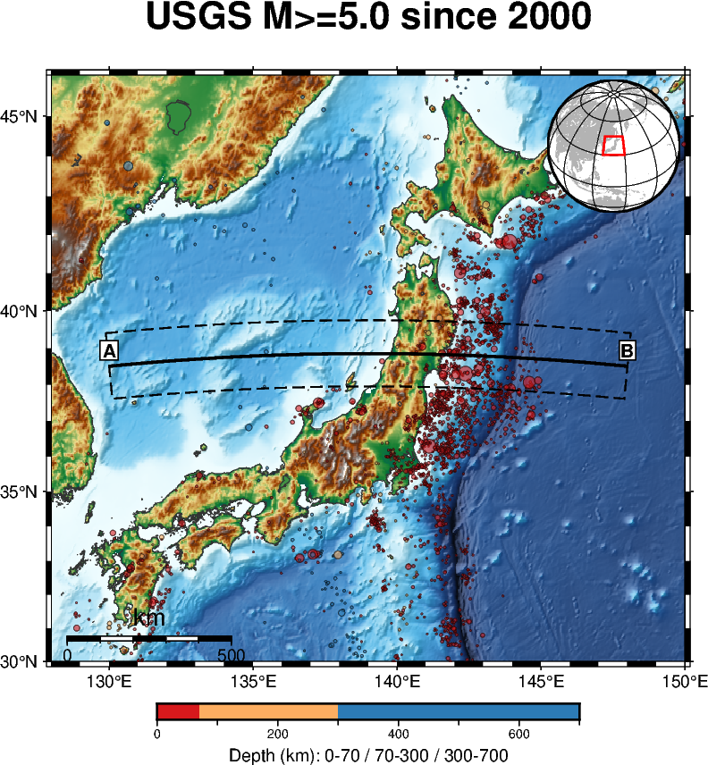
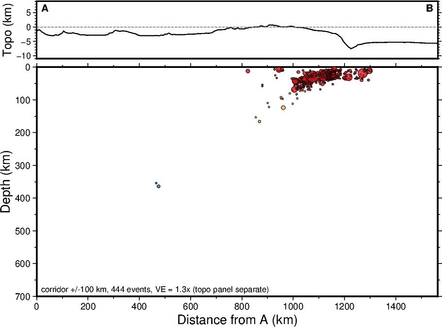
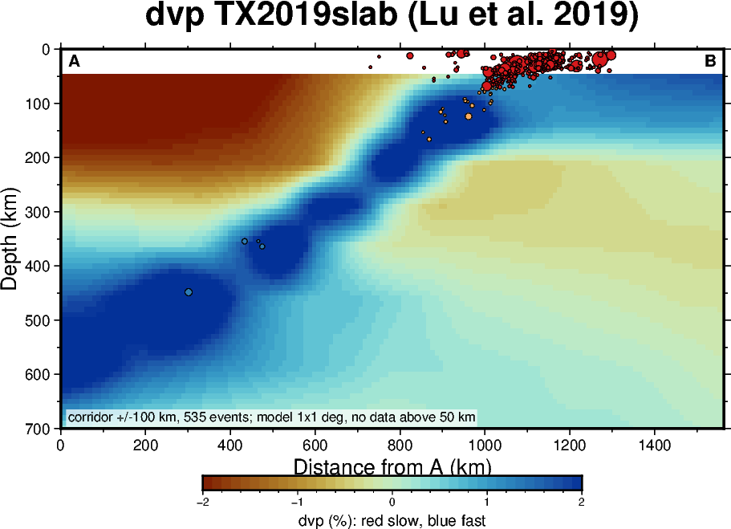
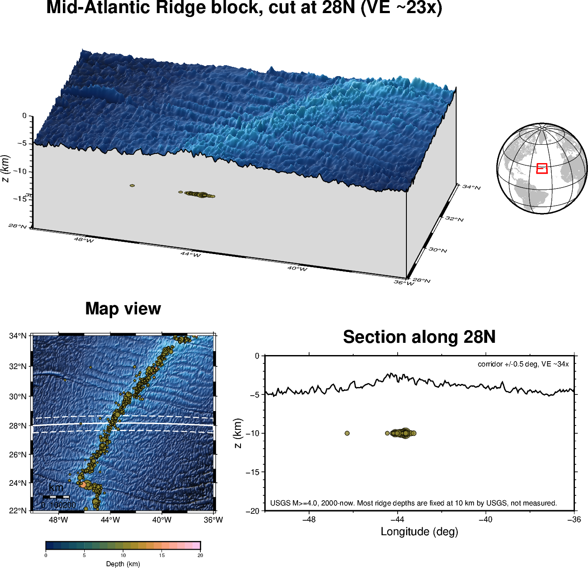
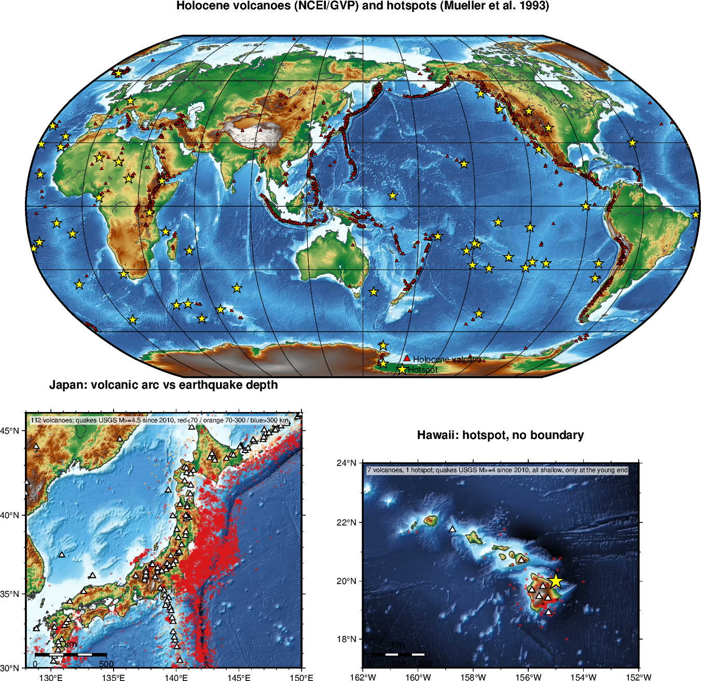

# 03｜AI 探索與作業：畫世界的板塊交界帶

[回課程首頁](README.md) · [交界帶整理表](plate-boundaries.md) · [範例程式 examples/](examples/)

前兩份 Notebook 用台灣練習了地圖、地震深度上色與地形。這一份把同一套方法搬到世界其他地方：**選一段板塊交界帶，畫出海底地形與地震分布，再切一條 A–B 剖面**，從圖上的證據說明它是哪一類交界。這堂課接著就是板塊構造，你畫的圖會是下堂課的討論材料。

這份不是 Notebook。下面每張範例圖都附對應的程式（`examples/` 裡一支一張圖），把程式和圖一起交給 AI，告訴它你要換哪個區域，它就能開始改。執行環境自己想辦法：本機裝 PyGMT，或把 repo clone 到 Colab 跑，兩種都可以。

事先知道答案沒關係，例如大家都知道日本是隱沒帶。重點是**你的圖能不能拿出證據**：海溝在哪裡、洋脊在哪裡、地震最深到幾公里、剖面上有沒有一條傾斜的震帶。判斷對不對不是主要分數，證據寫得清不清楚才是。

## 怎麼開始

1. **Fork 課程 repo**，clone 到自己的電腦。作業最後也是交這個 repo 的網址，所以第一步就把它建好。
2. **準備執行環境**，兩條路擇一：
   - 本機：用 conda 裝 `pygmt=0.17 gmt=6.5 ghostscript=10.04 pandas`，裝一次就一直在。
   - Colab：新開一個 Notebook，第一格照 [01 的環境格](https://colab.research.google.com/github/jimmy60504/pygmt-map-lab/blob/main/01_maps_earthquakes.ipynb) 安裝，第二格 `!git clone` 自己的 fork，第三格 `%run examples/02_region_map_section.py`。
3. **先跑通範例**，看懂參數在哪裡：範圍、時間、規模門檻、A–B 兩端、走廊半寬。A、B 直接填經緯度，從地圖上讀座標即可。
4. **把範例貼給 AI**，告訴它你要換哪個區域、剖面要往哪個方向切。程式能跑、圖出來，再檢查圖例、比例尺、深度分級與資料來源。
5. **自己先判讀**，再問 AI 意見。AI 很想直接講答案，可以先要求它不要說，等你寫完證據再對照。
6. **結果不符合也如實寫**：沒地震的地方可能是真的安靜，也可能是資料太少；分不出來就寫分不出來。

可以這樣起頭：

> 我用 PyGMT 0.17。這是課堂範例（貼上 `examples/02_region_map_section.py`）。請把區域改成＿＿，地震改成 2000 年起 M ≥ 5，先用 USGS 的 count 查筆數，超過 20,000 就提高規模門檻。地圖用地形當底、地震依 0–70、70–300、300–700 km 三段上色，再畫一條大致垂直地震帶的 A–B 剖面，深度軸 0–700 km，標示 VE、比例尺與資料來源。先不要告訴我這裡是哪種板塊交界，我要自己判斷。

## 三大類交界帶，在地形與地震上長什麼樣

分類沿用 Lillie (1999)《Whole Earth Geophysics》第 2 章：張裂（divergent）、聚合（convergent）、轉形（transform）三大類，再各分小類。下表只講「圖上會看到什麼」，判讀時逐項對照：

| 大類 | 小類 | 地形訊號 | 地震訊號 | 剖面上的樣子 |
| --- | --- | --- | --- | --- |
| 聚合 | 海洋–海洋隱沒 | 深海溝，旁邊一串火山島弧，弧後常有海盆 | 由海溝往島弧方向逐漸變深，可達數百公里 | 一條傾斜的深震帶 |
| 聚合 | 海洋–大陸隱沒 | 海溝緊貼大陸邊緣，陸上有高山與火山鏈 | 同上，往大陸下方傾斜 | 一條傾斜的深震帶 |
| 聚合 | 大陸–大陸碰撞 | 沒有海溝，有極寬的高山與高原，火山少 | 淺到中深，分布寬而散 | 寬而淺的一片，沒有清楚的傾斜帶 |
| 張裂 | 中洋脊 | 海底長條隆起，慢速者中央有裂谷，被垂直的斷裂帶切成段 | 只有淺震，沿脊軸窄窄一條 | 全在最上層 |
| 張裂 | 大陸裂谷／年輕海洋 | 陸上長條裂谷、湖泊、火山；或狹長的新生海 | 淺震為主，沿裂谷分布 | 全在最上層 |
| 轉形 | 海洋／大陸轉形斷層 | 直線狀的地形錯動，無海溝也無火山鏈 | 淺震沿線排列，幾乎沒有中深震 | 全在最上層、窄 |

**深度分級**照常見慣例：淺 0–70 km、中 70–300 km、深 300–700 km。有中深震幾乎就是隱沒帶；只有淺震，就要靠地形分辨張裂或轉形。

三個提醒：

- **沒有地震不代表沒有交界**。有些隱沒帶幾十年安靜，目錄裡幾乎沒有點；地震少本身也是要寫進圖說的觀察。
- **深度不一定是量到的**。USGS 對洋脊與某些陸區的地震常直接填 10 km 或 33 km 的預設深度，畫出來會排成一直線。看到整排同深度，先查是不是預設值。
- **一個框可能同時有兩類**。交界帶會轉彎、分段；框裡看到兩種訊號是正常的，分段說明即可。

主要板塊先看這張：

*十五大板塊與運動方向（中文標示）。Qingdou 繪、高柏瑋修改，[Wikimedia Commons](https://commons.wikimedia.org/wiki/File:Bankuai.png)，CC BY-SA 4.0。*

再看 USGS 的掛圖 [This Dynamic Planet（2006，正面）](https://pubs.usgs.gov/imap/2800/TDPfront-screen.pdf)，板塊、火山、地震與撞擊坑都在同一張圖上，公有領域。課本的板塊圖有版權，不放這裡。

## 範例圖：從全球看到一段剖面

每張圖下面寫「這張圖在看什麼」與對應的程式。程式開頭都有一小段參數區，改那裡就能換區域；資料都是執行時從網路抓，不用先下載。

### 1. 全球總覽：地震帶就是交界帶

USGS 2000 年起 M ≥ 5.5 的地震依三段深度上色，白三角是全新世火山，黃星是熱點。紅點連成的帶子就是交界帶；橘與藍只出現在隱沒帶；火山沿隱沒帶和裂谷排列，熱點大多散在板塊內部。從這張圖挑一段你想畫的地震帶，記下大概的經緯度。

程式：[examples/01_global_overview.py](examples/01_global_overview.py)

### 2. 八段交界帶的平面圖：先分「有沒有中深震」

同一套設定畫八個框，一眼分出兩群：日本、東加、秘魯–智利有橘點和藍點，往陸地或島弧方向變深；東非、東太平洋隆起、聖安德列斯、喜馬拉雅全是紅點，要靠地形分辨是裂谷、洋脊、直線錯動還是高原。卡斯凱迪亞海溝和火山鏈都在，卻幾乎沒有點，是「沒有地震不代表沒有交界」的例子。

程式：[examples/05_map_views_eight_regions.py](examples/05_map_views_eight_regions.py)。跨換日線的框直接把經度寫到 190，USGS 和 PyGMT 都接受。

### 3. 區域範本：地圖加 A–B 剖面（以日本為例）

這是你要交的最基本形式。地圖有地形、三段深度、A–B 線與走廊、比例尺與角落的位置示意；剖面上方是沿線地形，下方是走廊內地震的距離–深度圖，深度軸固定 0–700 km，不同區域才能對照。日本這條從日本海切到海溝：海溝旁一大叢淺震，東北日本下方 100–150 km 的中源震，日本海下方 350–450 km 的深震，整體往西傾斜。程式最後會印出圖說骨架，包括走廊內有多少深度是 USGS 的預設值。

程式：[examples/02_region_map_section.py](examples/02_region_map_section.py)

### 4. 進階：把速度構造鋪在剖面底下

地震只標出正在破裂的位置；層析成像看得到冷的板片本身。同一條 A–B 底下鋪上 TX2019slab（Lu et al. 2019）的 P 波速度異常：藍色快、紅色慢。日本這條看到一條往西傾斜的高速帶從海溝一路到 600 km 以下，地震貼著它的上緣；換成喜馬拉雅會看到 50–250 km 一整片平的高速蓋層橫跨剖面，是印度岩石圈插到高原下方，沒有傾斜構造。模型 1°×1°、22 層、50 km 以下才有值，6.7 MB，首次執行下載；三維模型由 GMT 自己讀，不用多裝套件。

程式：[examples/03_tomography_section.py](examples/03_tomography_section.py)。不想寫程式也可以用 [EarthScope EMC 的線上剖面工具](https://ds.iris.edu/dms/products/emc/emc-assets/about/generalized_cross_section_about.html) 直接出圖。

### 5. 3D 海底方塊與切面：以中大西洋洋脊為例

只畫切線以北的半塊地形，方塊的南緣就是切面，走廊內的地震投到切面上；右邊的小地球儀標出研究區與切線，下面配平面圖與 2D 剖面。洋脊區的地震全在最上層，平行洋脊的皺紋是深海丘，橫向的溝是斷裂帶。注意這個框內 97% 的地震深度是 USGS 固定的 10 km，不是量到的，洋脊區只能說「淺」。

程式：[examples/04_ridge_block_3d.py](examples/04_ridge_block_3d.py)。3D 的垂直誇大二十幾倍，海底看起來像砂紙是誇大的結果，不是資料有問題。

### 6. 火山與熱點：多一個判別線索

日本的火山弧與海溝平行，正好落在橘色中源震的正上方，這是隱沒帶的標準配置。夏威夷有火山鏈也有地震，但地震全是淺震、只集中在最年輕的大島，沒有海溝也沒有傾斜震帶，所以不是交界。隱沒帶與裂谷有火山鏈，轉形斷層與碰撞帶沒有。

程式：[examples/06_volcanoes_hotspots.py](examples/06_volcanoes_hotspots.py)

## 世界板塊交界帶整理：挑一段來畫

整理表另放在 [plate-boundaries.md](plate-boundaries.md)：隱沒帶、大陸碰撞、中洋脊、大陸裂谷、轉形斷層共三十多段，加一個「不是交界」的對照組，每段附範圍、兩側板塊與「佐證時注意」。從裡面挑一段，或自己框。

怎麼選：

1. 框 10–20 度寬，把海溝或洋脊整條框進去，交界兩側都留空間。
2. 先查筆數：2000 年起 M ≥ 5 多數區域在幾百到幾千筆；超過 20,000 提高規模，少於幾十筆就拉長時間或接受「這裡本來就少」。
3. A–B 大致垂直地震帶，半寬 50–150 km；混合型的框分段畫。
4. 建議配對：一段有中深震的、一段只有淺震的，對照最清楚。

## 選一個 AI 工具，開始做圖

課堂以 **Codex** 示範；你也可以用自己熟悉的工具，不必全部安裝，也不用為這堂課特別付費訂閱。重點是把問題說清楚、跑出圖，再檢查結果。

| 工具與官方資源 | 這堂課可以怎麼用 | 帳號與注意事項 |
| --- | --- | --- |
| [Codex](https://developers.openai.com/codex/auth/)（主要示範） | 使用前堂安裝的工具，協助修改程式、排除錯誤與加入互動功能。 | 有可使用 Codex 的 ChatGPT 帳號／訂閱，就用自己的帳號登入；額度以帳號顯示為準。 |
| [Claude Code](https://code.claude.com/docs/en/quickstart) | 已習慣 Claude 的同學，可以用它完成同樣的作圖任務。 | 已有支援 Claude Code 的訂閱（例如 Pro／Max）可使用自己的帳號，仍有使用額度限制。 |
| [Colab Gemini](https://research.google.com/colaboratory/faq.html) | 直接在 Notebook 的 Gemini 面板討論、修改程式或請它協助看錯誤，不必另外安裝 agent。 | 使用自己的 Google 帳號；功能是否開放受帳號資格、地區與額度限制，以介面為準。 |
| [OpenCode](https://opencode.ai/docs/)／[免費模型資訊](https://opencode.ai/docs/zen/) | 另一個 coding agent 選擇；可以先用當下提供的免費模型，從修改範例與簡單作圖開始。 | OpenCode 是工具，背後可選不同模型；請確認模型標示為免費。免費名單與供應狀況會變動，不代表所有模型都免費。 |

**怎麼選？** 跟著課堂就用 Codex；已有 Claude Code 或 Codex 訂閱就沿用；不想另裝工具可先用 Colab Gemini，想試其他 agent 則可用 OpenCode 的免費模型。遇到額度限制可以換工具，不必急著付費。

使用外部 agent 時，要提供目前的程式與完整錯誤訊息，並告訴它執行環境是 Colab、使用 PyGMT。電腦裡修改的檔案不會自動同步到 Colab，更新後仍要在 Colab 執行確認。

訂閱登入和付費 API 是不同的使用方式；本課不要求購買 API 額度。不要把 API key、密碼或登入憑證放進 Notebook／GitHub，使用電腦教室公用電腦後記得登出。

## AI 畫完後，檢查這張圖說清楚了嗎？

程式能跑、圖看起來漂亮，不代表讀者就能正確理解。把圖和圖說放在一起，檢查下面幾件事：

| 檢查項目 | 要注意什麼 |
| --- | --- |
| **主題與圖說** | 一眼能看出你想表達什麼嗎？圖說交代資料與範圍、如何呈現、實際觀察到什麼；分清楚觀測、模型與推論，不把原本的猜想直接寫成結論。 |
| **座標與單位** | 軸的名稱、單位、時間基準／時區是否清楚？是線性還是對數尺度？地圖用經緯網定位、用經緯網或北箭頭辨向；剖面兩端標出 A、B 與方位。 |
| **地圖比例尺** | 加上標有距離單位的比例尺，讓讀者判斷空間尺度；更換投影或範圍時要重新確認，局部放大圖也要有自己的尺度資訊。 |
| **圖例與色條** | 點、線、符號、大小、顏色各代表什麼？數值色條要有單位；超出色階與缺資料怎麼表示？規模不等於震度。 |
| **尺度與子圖對照** | 多張圖的顏色、大小與座標尺度能直接比較嗎？A–B 方向、子圖編號與框選範圍是否一致？若尺度不同，要明確交代。 |
| **篩選與不確定性** | 哪些時間、區域或規模被保留？是否做過平滑、插值或正規化？空白不一定代表沒有現象，可能只是缺資料；需要時呈現誤差或模型限制。 |
| **可讀性** | 縮到實際觀看大小後，字、線和圖例還看得清楚嗎？大圓、標籤、等高線或陰影有沒有遮住重點？ |

**剖面拉伸：標出垂直誇大倍率（VE）**

淺部剖面可以拉伸垂直方向，讓起伏更清楚，但要標示例如 `VE = 5×`。先把水平與垂直的實際距離換成同一單位，再比較它們在圖上的長度比例；相同實際距離若垂直畫得比水平長五倍，就是五倍誇大。不能只拿圖框的高／寬當成 VE，也不能直接用拉伸後的圖量斷層傾角。旋轉的 3D 透視圖則另有視角影響，不要把 `zsize` 直接當成 VE。

**局部放大：讓讀者知道這一小塊在哪裡**

局部地圖可在角落加一張較大範圍的位置示意圖（inset），用小框標出主圖涵蓋的範圍；也可以在大範圍主圖框出一區，再用另一張圖放大細節。框線、連接線或 `(a)、(b)` 要能清楚對照，並注意放大前後是否使用不同尺度。縮圖以定位為主，不必堆滿資料。

**顏色：不要只靠「看起來漂亮」來選**

- 重要類別不要只靠紅、綠區分，也可搭配符號、線型或文字。
- 有大小次序的量、正負異常與不同類別，適合的色票不一樣；顏色變化應幫助讀者理解資料。
- 用色覺模擬檢查；灰階可輔助檢查，但不能取代色覺測試。社群常用的色票也不一定是最友善的選擇。

可參考 [Seismica 的色票要求](https://seismica.library.mcgill.ca/submission-checklist) 與 [Nature 圖像規範](https://research-figure-guide.nature.com/figures/preparing-figures-our-specifications/)。各期刊要求不同，投稿時再確認目標期刊的規定。

**這份作業另外檢查三項**

- 深度分級的界線（70、300 km）有沒有寫在圖例上？
- 剖面線是否大致垂直地震帶？走廊半寬多少、幾筆事件，有沒有寫？
- 圖說有沒有寫下載日期、規模門檻，以及多少深度是 USGS 預設值？

可以請 AI 協助逐項檢查，但座標、單位、VE、資料來源和圖說，仍要自己對照資料確認。

## 先逛逛論文的圖，找找靈感

先看 [地震學常見圖像](https://github.com/jimmy60504/pygmt-map-lab/blob/main/earthquake-figure-guide.md) 認識各種圖型與範例，再看 [論文圖收集](https://github.com/jimmy60504/pygmt-map-lab/blob/main/figure-examples.md) 比較漂亮的和普通的。

不用一開始就讀懂整篇 paper。先到 [Google Scholar](https://scholar.google.com/) 搜尋 `seismic`、`earthquake` 或 `seismicity`，也可以加上 `Taiwan`、`subduction`、`cross section`、`waveform` 等地區或圖像關鍵字。或先用 Google 圖片搜尋，看到有興趣的圖，再回到原論文看圖說。

也可以直接逛這些期刊，挑一篇題目有興趣的文章，先翻圖片：

| 期刊入口 | 主要範圍 | 逛圖時可以找什麼 |
| --- | --- | --- |
| [SRL — Seismological Research Letters](https://pubs.geoscienceworld.org/srl) | 地震學及相關觀測、方法與應用 | 地震事件、測站、波形與資料展示。 |
| [BSSA — Bulletin of the Seismological Society of America](https://pubs.geoscienceworld.org/bssa) | 地震學與相關研究 | 地震分布、震源、地動與分析結果。 |
| [GJI — Geophysical Journal International](https://academic.oup.com/gji) | 固體地球物理，不限地震 | 地下構造、剖面、波形與模型比較。 |
| [GRL — Geophysical Research Letters](https://agupubs.onlinelibrary.wiley.com/journal/19448007) | 地球與太空科學，不限地震 | 搜尋地震相關文章，看作者怎麼用少量圖呈現重點。 |
| [Seismica](https://seismica.library.mcgill.ca/) | 地震學與地震科學，開放取用 | 地震研究、資料與方法的各種呈現方式。 |

挑一張喜歡的圖就好，想想：**它想表達什麼？資料怎麼篩選或排列？我可以借用哪種畫法來表達自己的問題？** 重點是學呈現方式，不是照抄結論，也不必做出同樣複雜的研究。遇到付費文章，可找開放版本或換一篇。

把原論文連結與圖號留給自己，也可以給 AI 當討論參考。圖片搜尋只是入口，仍要回原文確認圖說；若要把原圖放進公開 GitHub，需確認授權並標明來源。

## 這份作業會用到的資料

課堂範本已經把前四項接好；後面幾項是佐證用的補充，作品仍需用到 PyGMT，可搭配其他工具。

| 想找什麼 | 資料入口 | 可以做什麼 |
| --- | --- | --- |
| 全球地震目錄 | [USGS](https://earthquake.usgs.gov/fdsnws/event/1/)／[ISC Bulletin](https://www.isc.ac.uk/iscbulletin/search/) | 位置、深度、規模；USGS 單次上限 20,000 筆，ISC 整合各國網、小地震較全 |
| 台灣更細的地震 | [氣象署 GDMS](https://gdms.cwa.gov.tw/) | 想把台灣當對照組時用 |
| 海陸地形 | [GMT 全球地形](https://docs.generic-mapping-tools.org/latest/datasets/remote-data.html)／[GEBCO](https://www.gebco.net/data-products/gridded-bathymetry-data) | 海溝、洋脊、裂谷、斷裂帶；大框用 05m，細看用 01m 或 15s |
| 火山 | [NOAA NCEI 火山位置](https://www.ngdc.noaa.gov/hazel/view/hazards/volcano/loc-search)／[Smithsonian GVP](https://volcano.si.edu/) | 火山鏈平行海溝是隱沒帶、沿裂谷是張裂、轉形帶沒有 |
| 熱點 | GMT `@hotspots.txt`（Müller et al. 1993） | 板塊內部的火山，當「不是交界」的對照 |
| 板塊邊界線 | [Bird (2003) PB2002](http://peterbird.name/publications/2003_pb2002/2003_pb2002.htm)（[GeoJSON](https://github.com/fraxen/tectonicplates)）／[Hasterok et al. (2022)](https://github.com/dhasterok/global_tectonics) | 判讀完再疊上去對答案；PB2002 每段有類型碼 |
| 板片深度 | [Slab2（USGS）](https://www.sciencebase.gov/catalog/item/5aa1b00ee4b0b1c392e86467) | 隱沒帶的板片幾何，可疊在剖面上檢查傾斜帶 |
| 速度構造 | [EarthScope EMC](http://ds.iris.edu/ds/products/emc/) | 層析模型的剖面，看板片與岩石圈 |
| 震源機制 | [Global CMT](https://www.globalcmt.org/CMTfiles.html) | 逆衝、正斷層、走滑各對應聚合、張裂、轉形；用 `fig.meca()` 畫 |

下載前請 AI 一起檢查年份、座標系統、單位與授權。深度、規模的定義各目錄不同，不要混用；資料疊在一起不代表已證明因果。

## 兩週後繳交

作業就用 AI 做：選一段板塊交界帶，畫圖、切剖面、寫證據。

作品請把**圖＋圖說**放在一起，內容三件事：

1. **一段交界帶的地圖與至少一條 A–B 剖面**：地形當底，地震依三段深度上色、大小表規模，有比例尺、圖例與位置示意；剖面深度軸到 700 km，標 VE。可以沿用課堂範本改參數，也可以請 AI 重寫。
2. **圖說三段**：這裡看到什麼地形與地震分布；這符合哪一類交界、圖上哪些特徵是證據；哪些地方不符合或不確定，還缺什麼資料。
3. **資料註記**：來源、時間範圍、規模門檻、走廊半寬、有多少深度是預設值。

加分（自由）：再畫一段不同類型做對照；加上火山、熱點、速度剖面或震源機制當佐證；畫多條剖面看沿走向的變化。

作業只需滿足三個條件：

1. **作品與 PyGMT 有關。**
2. **將作品上傳 GitHub，繳交 repository 連結**，並確認教師能開啟。
3. **附上 AI 對話紀錄**：把和 AI 來回的過程存進同一個 repository，例如對話分享連結、匯出的文字檔或截圖。不用整理，重點是看得到你怎麼提問、AI 改了什麼、你怎麼檢查。

判斷對錯不是主要分數；圖是否完整可讀、推論是否有圖上證據、有沒有誠實寫出不確定，才是。兩週後繳交，答案在板塊構造課對照板塊邊界模型一起揭曉。

## 資料來源與版本

- [GMT 全球地形資料](https://docs.generic-mapping-tools.org/latest/datasets/remote-data.html)：PyGMT 載入，首次使用需連網。
- [USGS 地震目錄 API](https://earthquake.usgs.gov/fdsnws/event/1/)：查詢條件包含在下載網址中；單次上限 20,000 筆。
- [NOAA NCEI 火山位置 API](https://www.ngdc.noaa.gov/hazel/view/hazards/volcano/loc-search)：全新世火山，源自 Smithsonian Global Volcanism Program。
- GMT 範例檔 `@hotspots.txt`：Müller, Royer & Lawver (1993), *Geology* 21, 275–278。
- [EarthScope EMC TX2019slab](https://data.earthscope.org/app/products/portal/emc_model_viewer.html?id=EMC-TX2019slab)：Lu, Grand, Lai & Garnero (2019), *JGR Solid Earth*, doi:10.1029/2019JB017448。
- 交界帶分類：Lillie, R. J. (1999). *Whole Earth Geophysics*. Prentice Hall, ch. 2。板塊圖以 [USGS This Dynamic Planet (2006)](https://pubs.usgs.gov/imap/2800) 公有領域版本代替。
- [PyGMT 0.17 安裝文件](https://www.pygmt.org/v0.17.0/install.html)
- [原始課程參考 Notebook](https://github.com/oceanicdayi/plot_plate_boundary_pygmt/blob/main/pygmt_plot_plate_boundary.ipynb)
