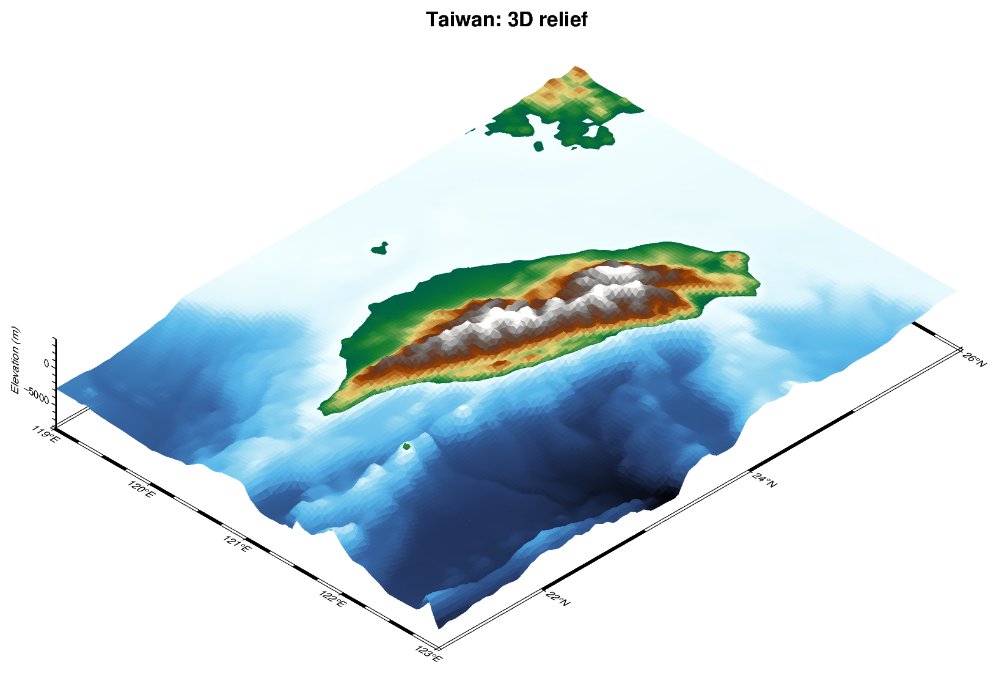

# 地震學常見圖像：先學看圖，再學畫圖

這份筆記供課前導讀與選圖備課使用，可放在 GMT／PyGMT 介紹之前。不是完整分類，也不是要學生全部做過，而是認識地震學如何用圖溝通。

核心問題：**這張圖想回答什麼？它用哪些視覺慣例，讓同行讀得懂？**

每節先列圖型，再放幾張範例圖；圖片連自來源網站，出處與授權標在圖下。

## 一、地震發生在哪裡？

| 常見圖 | 想回答的問題 | 常見畫法與讀圖提醒 |
| --- | --- | --- |
| 地震分布圖（seismicity map） | 地震集中在哪裡？和斷層、板塊有什麼空間關係？ | 圓點表示事件，大小常對應規模，顏色可對應深度或時間；必須看圖例，不能光靠顏色猜。 |
| 區域構造／研究區域圖 | 研究在哪裡？有哪些重要地形與構造？ | 地形背景、斷層線、板塊邊界、地名和小型位置圖；底圖要襯托主題，不要搶過資料。 |
| 測站分布圖（station map） | 哪些測站記錄到事件？觀測覆蓋如何？ | 測站常用三角形並標站碼，主震常用星形；位置分布不等於每站都有完整可用資料。 |
| 震源剖面（hypocenter cross-section） | 地震在地下如何排列？ | 地圖標 A–B 與取樣寬度，剖面畫沿線距離—深度；深度通常向下增加，需確認垂直誇大倍率。 |
| 三維地震／地形圖 | 空間分布從不同角度看有何不同？ | 透視、旋轉與深度軸能幫助理解，但會有遮蔽；重要結論仍適合搭配平面圖或剖面。 |

**範例圖**

*地震分布圖。[Scientific Data (2026) Fig. 1](https://www.nature.com/articles/s41597-026-07523-6/figures/1)，CC BY 4.0。點依規模上色、大小一致；問學生：大地震在哪裡？*

*區域構造／研究區域圖，A 框出 B、B 框出 C 的層層縮放。[Communications Earth & Environment (2026) Fig. 1](https://www.nature.com/articles/s43247-026-04037-2/figures/1)，CC BY 4.0。*

*測站分布圖（B：紅色三角形測站與站碼、黑色三角形參考站、斷層線）。[Scientific Reports (2026) Fig. 1](https://www.nature.com/articles/s41598-026-51640-6/figures/1)，CC BY-NC-ND 4.0，未修改。*

*震源剖面。地圖標 A–A′ 到 D–D′，剖面畫沿線距離—深度並疊上板塊模型線；圖說交代剖面寬 5 km、方位 108°。[Nature (2024) Fig. 1](https://www.nature.com/articles/s41586-024-07245-y/figures/1)，CC BY 4.0。*

*三維地形圖，本課 02 Notebook 的輸出。地震點也可以用 [PyGMT 3-D scatter](https://www.pygmt.org/v0.17.0/gallery/3d_plots/scatter3d.html) 放進透視圖。*

可從 [USGS 地震地圖](https://earthquake.usgs.gov/earthquakes/map/) 看事件分布；[USGS 公開產品說明](https://earthquake.usgs.gov/data/ground-failure/background.php) 有明確的星形震央、三角形測站與斷層範圍圖例，可作為「符號是一種社群語言」的實例。

## 二、地震怎麼發生，又怎麼演變？

| 常見圖 | 想回答的問題 | 常見畫法與讀圖提醒 |
| --- | --- | --- |
| 時間—規模圖 | 何時發生大震？前後有哪些事件？ | 橫軸時間、縱軸規模；可突出主震。不要把規模寫成震度，時間要說清楚時區。 |
| 事件數／累積事件數圖 | 地震活動隨時間如何變化？ | 每日事件數用柱狀或折線，累積數用曲線；累積曲線本來就不會下降，要看斜率。 |
| 時間—距離圖 | 地震位置是否隨時間遷移？ | 把事件投影到某條線，畫時間與沿線距離；必須交代參考點、方向和取樣範圍。 |
| 規模—頻率分布（Gutenberg–Richter） | 不同規模的地震有多少？ | 常画規模與對數事件數；區分分箱數量與累積數量，估計 b 值前要處理目錄完整性，不能把小震漏報當物理結果。 |
| 震源機制解（focal mechanism／beachball） | 震源的斷層運動型態是什麼？ | 黑白或雙色沙灘球表現機制，不是普通圓餅圖；對雙力偶機制，兩個節面不代表已知道哪個是真正斷層面。 |
| 有限斷層／滑移分布圖（finite-fault slip） | 斷層哪裡滑得多？破裂如何展開？ | 用顏色表示滑移量，可能疊加破裂時間等值線；這是模型推估，不是直接拍到的地下影像。 |

**範例圖**

*一張圖包了三種：a 是時間—距離圖（依深度上色，右軸累積地震矩），b 是時間—規模圖（右軸累積位移），c 把機制解排在時間軸上，d 是時頻圖。[Nature (2025) Fig. 2](https://www.nature.com/articles/s41586-025-09525-7/figures/2)，CC BY 4.0。*

*事件數圖，每年 M3+ 地震數的柱狀圖，附分布圖。[USGS，Wikimedia Commons](https://commons.wikimedia.org/wiki/File:Cumulative_induced_seismicity.png)，公有領域。*

*Gutenberg–Richter 圖。上：規模與對數累積事件數，小規模端偏離直線就是目錄不完整；下：分箱數量。[Wikimedia Commons](https://commons.wikimedia.org/wiki/File:Gutenberg%E2%80%93Richter_law_in_the_2016_Central_Italy_earthquake_(magnitude).png)，CC BY-SA 4.0。*

*震源機制解（沙灘球）。[PyGMT gallery：Focal mechanisms](https://www.pygmt.org/v0.17.0/gallery/seismology/meca.html)，BSD-3。多個機制解排在地圖上的做法，見上面 Esmeraldas 那張。*

*有限斷層滑移分布。顏色是滑移量、箭頭是滑移方向、虛線是每 10 秒的破裂前緣；座標是沿走向與沿傾向距離。[USGS，Wikimedia Commons](https://commons.wikimedia.org/wiki/File:Davao_earthquake_M7.4_finite_fault.png)，公有領域。*

範例入口：[規模—頻率研究報告](https://pubs.usgs.gov/of/2013/1165/pdf/ofr2013-1165_appendixL.pdf)、[PyGMT 機制解範例](https://www.pygmt.org/v0.16.0/gallery/seismology/meca.html)、[USGS 有限斷層產品](https://earthquake.usgs.gov/data/finitefault/)。機制解範例連結為 0.16 版，這裡用來看圖，不作為課堂版本設定。

## 三、測站記錄到什麼？

| 常見圖 | 想回答的問題 | 常見畫法與讀圖提醒 |
| --- | --- | --- |
| 地震波形（seismogram） | 某個測站在什麼時間記錄到什麼訊號？ | 時間—振幅曲線，常標 P、S 到時；要知道測站、通道、濾波與振幅單位，原始 counts 不等於地動速度。 |
| 多測站波形排列（record section） | 波如何傳到不同距離的測站？ | 按震央距或其他順序排列波形，可疊加理論走時；逐道正規化後不能直接比較絕對振幅。 |
| 走時曲線（travel-time curve） | 不同震相何時到達？ | 距離—到時關係，可比較理論曲線與觀測拾取點；區分發震時間基準與對齊某個震相的時間。 |
| 頻譜／時頻圖（spectrum／spectrogram） | 訊號有哪些頻率？頻率如何隨時間變化？ | 頻譜畫頻率—振幅或功率；時頻圖用顏色表示強度。要交代頻率單位、對數尺度、色階與處理方式。 |

**範例圖**

*單站波形。標題寫了網路、測站、通道（IU.ANTO.00.BHZ）與取樣率；縱軸是 counts，不是地動速度。[Wikimedia Commons](https://commons.wikimedia.org/wiki/File:Turkey_magnitude_7.5_earthquake_(12-24_PM,_6_February_2023).png)，CC BY 2.0。*

*多測站波形排列。橫軸震央距、縱軸時間，到時隨距離變晚。[ObsPy 波形繪圖教學](https://docs.obspy.org/tutorial/code_snippets/waveform_plotting_tutorial.html)。*

*走時曲線。橫軸震央距（度）、縱軸時間，各震相一條線，紅色是高頻常觀測到的相。[Wikimedia Commons](https://commons.wikimedia.org/wiki/File:Time-distance_curve.png)，CC0。*

*同一段訊號的三種看法：上是波形，中是時頻圖（顏色為強度），下是頻譜。[Wikimedia Commons](https://commons.wikimedia.org/wiki/File:23eruption.png)，CC BY-SA 4.0。時頻圖用的彩虹色階正好可以拿來討論。*

看圖入口：[IRIS／EarthScope 波形觀看資源](https://www.iris.edu/hq/programs/epo/resources_for_viewing_seismograms)、[多測站 Event Plots](https://ds.iris.edu/dms/products/eventplot/)、[SeisSound 時頻與聲音展示](https://ds.iris.edu/dms/products/seissound/)。這類圖需要波形資料，不是下載地震目錄就能畫。

## 四、地表搖多大？地下長什麼樣？

| 常見圖 | 想回答的問題 | 常見畫法與讀圖提醒 |
| --- | --- | --- |
| 震度／地動分布圖（ShakeMap） | 各地受到多強的搖晃？ | 色塊或等值線表示震度、PGA、PGV 等；這些量不能混用，規模也不是地圖上各地的震度。 |
| 地下速度構造圖（tomography） | 地震波在哪些區域較快或較慢？ | 水平切片或剖面以顏色表示速度或相對異常；必須看參考模型、單位與解析能力，紅藍沒有跨所有論文通用的意義。 |

**範例圖**

*ShakeMap 震度分布圖。色階同時對應震度、PGA 與 PGV，圖下表格是換算關係；深度 155 km 的地震，震度分布很寬。[USGS，Wikimedia Commons](https://commons.wikimedia.org/wiki/File:USGS_ShakeMap_Aratoca_Santander_Colombia_Earthquake_2015.jpg)，公有領域。*

*層析成像剖面的簡化圖。顏色是相對參考模型的快慢，附剖面位置圖。[Wikimedia Commons](https://commons.wikimedia.org/wiki/File:FarallonTomoSlice.png)，CC BY-SA 4.0。*

參考：[USGS 規模與震度說明](https://www.usgs.gov/programs/earthquake-hazards/earthquake-magnitude-energy-release-and-shaking-intensity)、[ShakeMap 讀圖說明](https://escweb.wr.usgs.gov/share/shake2/haywired/about.html)、[EarthScope 地震層析成像介紹](https://www.earthscope.org/what-is/seismology/seismic-tomography/)。

## 五、要教的「共同文化」，不是死背規則

- **符號有預期，但沒有一套包辦所有圖的標準。** 三角形常是測站、圓點常是事件、星形常突出主震；叉號也可能表示位置、其他事件或參考點，仍以原圖圖例為準。
- **同一系列圖要能互相比較。** 相同顏色與大小盡量保持相同意義；更換尺度時明確標示。
- **地圖與剖面要對得起來。** A、B 順序、取樣寬度、顏色和事件篩選應一致。
- **底圖不是主角。** 海岸線、地形、網格、標籤服務於主題，避免全部同樣醒目。
- **圖例是閱讀契約。** 大小是半徑、面積還是分級？顏色代表什麼？缺資料與超出色階怎麼畫？都不能只靠讀者猜。
- **漂亮不等於有證據。** 稀疏點位不代表沒有地震；插值色塊不代表處處有觀測；模型也應交代限制。

### 色票要怎麼談？

先認清變數，再選色票。深度、滑移量等有大小次序的量，可考慮循序色階；相對參考值的正負異常，可考慮以零為中心的發散色階；事件分類則用類別色。社群慣用配色可以認識，但不必當成唯一正解。

本課使用 `batlow` 畫深度，是示範選擇，不是地震學的強制標準；Notebook 也提供 `gmt/seis` 作對照。彩虹色階辨識色段容易，但亮度變化可能造成視覺上的假邊界，也要留意色覺差異。請學生比較同一資料換色後，哪些構造突然變明顯或消失，而不只問「哪個比較漂亮」。色票入口：[GMT 色票與圖例文件](https://docs.generic-mapping-tools.org/6.1/cookbook/cpts.html)。

### 先逛逛論文的圖，找找靈感

課堂收集的實例與評語見 [論文圖收集](figure-examples.md)。

不用一開始就讀懂整篇 paper。先到 [Google Scholar](https://scholar.google.com/) 搜尋 `seismic`、`earthquake` 或 `seismicity`，也可以加上 `Taiwan`、`subduction`、`cross section`、`waveform` 等地區或圖像關鍵字。或先用 Google 圖片搜尋，看到有興趣的圖，再回到原論文看圖說。

也可以直接逛這些期刊，挑一篇題目有興趣的文章，先翻圖片：

| 期刊入口 | 主要範圍 | 逛圖時可以找什麼 |
| --- | --- | --- |
| [SRL — Seismological Research Letters](https://pubs.geoscienceworld.org/srl) | 地震學及相關觀測、方法與應用 | 地震事件、測站、波形與資料展示。 |
| [BSSA — Bulletin of the Seismological Society of America](https://pubs.geoscienceworld.org/bssa) | 地震學與相關研究 | 地震分布、震源、地動與分析結果。 |
| [GJI — Geophysical Journal International](https://academic.oup.com/gji) | 固體地球物理，不限地震 | 地下構造、剖面、波形與模型比較。 |
| [GRL — Geophysical Research Letters](https://agupubs.onlinelibrary.wiley.com/journal/19448007) | 地球與太空科學，不限地震 | 搜尋地震相關文章，看作者怎麼用少量圖呈現重點。 |
| [Seismica](https://seismica.library.mcgill.ca/) | 地震學與地震科學，開放取用 | 地震研究、資料與方法的各種呈現方式。 |

挑一張喜歡的圖就好，想想：**它想表達什麼？資料怎麼篩選或排列？我可以借用哪種畫法來表達自己的問題？** 重點是學呈現方式，不是照抄結論，也不必做出同樣複雜的研究。遇到付費文章，可找開放版本或換一篇。

把原論文連結與圖號留給自己，也可以給 AI 當討論參考。圖片搜尋只是入口，仍要回原文確認圖說；若要把原圖放進公開 GitHub，需確認授權並標明來源。

## 六、這堂課先挑哪些？

建議只挑三組真實例子，其他保留為 AI 作業的想像空間：

1. **公開地震報告的地圖**：認識事件、測站、主震、圖例，順便區分規模與震度。
2. **論文的地圖＋A–B 剖面**：看同一批資料如何從平面轉到地下，以及作者怎麼交代篩選條件。
3. **波形檢視工具或多測站排列圖**：讓學生知道地震資料不只有一張經緯度表，也有時間序列。

每張圖固定問三件事：「它想回答什麼？」「我靠什麼符號看懂？」「哪些資訊不能靠猜？」再接到 GMT／PyGMT 的圖層與參數。

選論文圖時保留作者、年份、圖號與來源連結；若要把原圖放進公開教材，先確認授權。各節的範例圖直接連到來源網站顯示，出處與授權標在圖下。漂亮與普通的論文圖對照，另見 [論文圖收集](figure-examples.md)。
